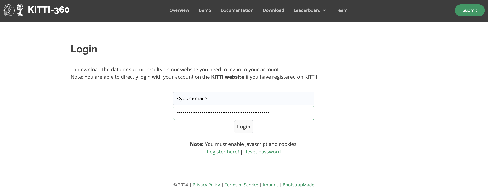
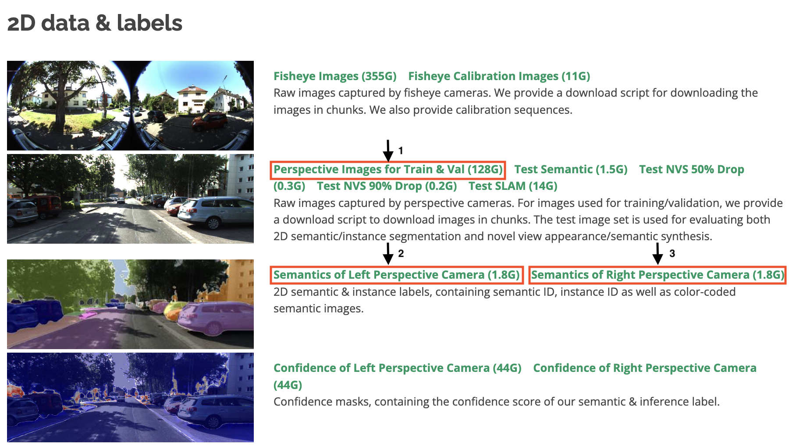
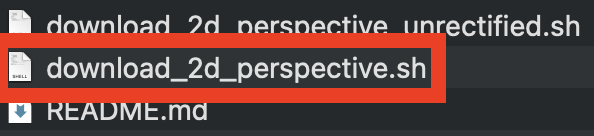
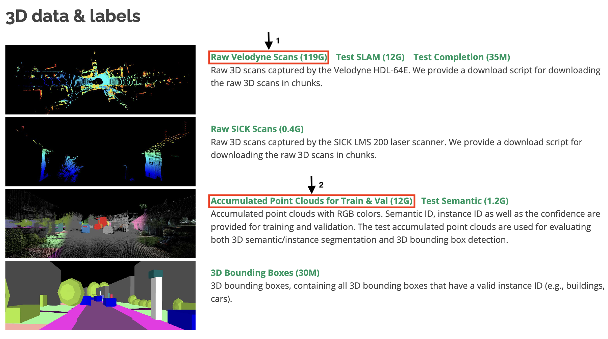
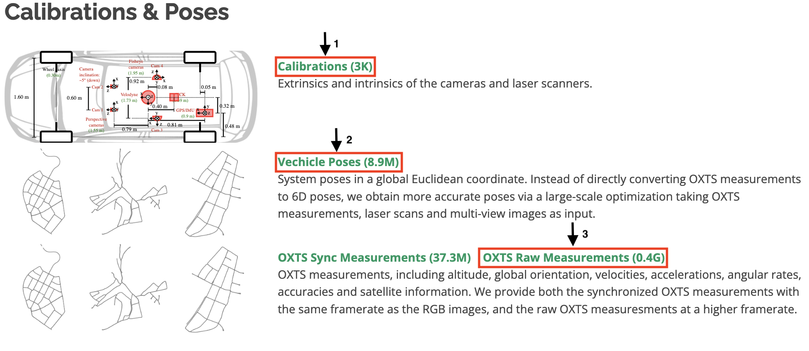

# Generating a mcap visualization from RAW dataset files (Python)
### Contributor: Doncey Albin

In this tutorial, I will walk you through the process of generating an mcap file using the KITTI-360 Dataset and Foxglove Python Schemas.

###  Need:
- Size of total dataset

## Download *Necessary* Data

 Before we can download the data used in this tutorial, we will need to first gain access to it. **Navigate to the [KITTI-360 Download Page](https://www.cvlibs.net/datasets/kitti-360/user_login.php), create an account, and log in.** *Note: you can use your KITTI accound credentials to log in, if you already have an account there.* 

[](https://www.cvlibs.net/datasets/kitti-360/user_login.php)

We will need to download a decent chunk of data (*** GB) to generate the mcap file. Make sure you have enough space on your SSD before we begin. You can remove this files after generating the mcap to free up space.

Before downloading the *necessary* data for this tutorial, let's create a directory named *foxglove_tutorials* with one subdirectory named *gen_mcap_kitti360*, proceeding with entering the *gen_mcap_kitti360* subdirectory. Where you decide to create the base *foxglove_tutorials* directory is up to you.

```bash
mkdir -p foxglove_tutorials/gen_mcap_kitti360
cd foxglove_tutorials/gen_mcap_kitti360
```

**1. Download *Necessary* 2D (Image) Data**. 
The KITTI-360 Dataset contains 2D image data from left (camera 0) and right (camera 1) forward-facing cameras. Lets download these 2D perspective images and their semantic data by clicking the links highlighted in red below.



The first download (as indicated with "1" in image above), *Perspective Images for Train and Val (128G)*, will download a zipped folder with three files: a README markdown file and two bash scripts. We only need one of the bash scripts, *download_2d_perspective.sh*.



<!-- This bash script will download all of the 2D perspective images for every KITTI-360 sequence aimed for training and validation of methods (mostly neural network, learned methods) to acheive top scores on their leaderboards for Sematic Scene Completion, novel view synthesis, and/or semantic SLAM. We will only want images from sequence 0, which in this set. We can modify the bash script  -->

Place the semantics directory and the *download_2d_perspective.sh* into your *gen_mcap_kitti360* subdirectory.

This bash script will download all of the 2D perspective images for both cameras from every KITTI-360 sequence aimed for training and validation (sequence 0 and sequences 2 through 10). We will only want images from sequence 0, which in this set. We can modify the bash script to meet this need:

**Change the following**:
```bash
train_list=("2013_05_28_drive_0000_sync"
            "2013_05_28_drive_0002_sync" 
	    "2013_05_28_drive_0003_sync"
            "2013_05_28_drive_0004_sync" 
            "2013_05_28_drive_0005_sync" 
            "2013_05_28_drive_0006_sync" 
            "2013_05_28_drive_0007_sync" 
            "2013_05_28_drive_0009_sync" 
	    "2013_05_28_drive_0010_sync")
```

**to**:
```bash
train_list=("2013_05_28_drive_0000_sync")
```

To run this bash script and download necessary files, simple run the following:

```bash
bash download_2d_perspective.sh
```

The time it takes to get this data largely depends on your internet speeds, so continue on reading if it's taking a while!

Running this bash script will immediately create a directory named *KITTI-360*. Place your *semantic_2d* directory in here.

**2. Download Necessary 3D (pointcloud) Data**. 
Download the 3D *Velodyne* pointcloud data and its associated semantic data.



Similar to the download of the 2D data above, the first download (as indicated with "1" in image above), *Raw Velodyne Scans (119G)*, will download a zipped folder with a single bash script, *download_3d_velodyne.sh*. Place the 3d_semantics directory into the *KITTI-360* directory and the *download_3d_velodyne.sh* bash script into your *gen_mcap_kitti360* subdirectory. 

We will edit the *download_3d_velodyne.sh* bash script to only download the velodyne pointclouds for sequence 0.

**Change**:
```bash
train_list=("2013_05_28_drive_0000_sync"
            "2013_05_28_drive_0002_sync" 
	    "2013_05_28_drive_0003_sync"
            "2013_05_28_drive_0004_sync" 
            "2013_05_28_drive_0005_sync" 
            "2013_05_28_drive_0006_sync" 
            "2013_05_28_drive_0007_sync" 
            "2013_05_28_drive_0009_sync" 
	    "2013_05_28_drive_0010_sync")
```

**To**:
```bash
train_list=("2013_05_28_drive_0000_sync")
```

To run this bash script and download necessary raw pointcloud files, simple run the following:

```bash
bash download_3d_velodyne.sh
```

This may also take awhile, so continue on reading!

**2. Download Necessary Calibration, Pose, and GPS Data**. 
The calibration, pose, and GPS data files are the fastest to download. Download these by clicking the links shown outlined in red boxes within the image below.



Make sure to move each of unzipped directories into the *KITTI-360* directory now within the *gen_mcap_kitti360* subdirectory.

Your final *KITTI-360* directory should now have the following subdirectory structure:

*INSERT IMAGE OF KITTI-360 FOLDER STRUCTURE HERE*

## Extract Per-Scan Labels for Velodyne Data

Unfortunately, unlike the SemanticKITTI dataset, there are not label files for each 3D Velodyne lidar scan. However, thanks to 

## Generating an MCAP file from KITTI-360 Data

For this section, we will be making use of the MCAP Writer, Foxglove Schemas, and good ol' Python.

To aid in this effort, let's clone the following Github repository in the *gen_mcap_kitti360* directory:

```bash
git clone 
```

If you do not use git (you should), then you can simply download the zipped version via it's GitHub URL. Make sure to place the unzipped repository into your *gen_mcap_kitti360* directory.

*INSERT IMAGE OF DOWNLOADING ZIP HERE*

Once in the base of the (((()))) repository, we can now create and activate a compatible conda environment with all of the necessary Python dependencies:

```bash
conda env create -f environment.yaml
conda activate 
```

If you do not use Conda for Python dependency management (you should), then you will need to install dependencies one-by-one:

```bash
pip install open3d
pip install foxglove-schemas-protobuf
```

Once you have all of the necessary Python dependencies, then you can start on the Python code!

**1. Available Scripts**
Within the (((()))) repository, there are a few Python scripts we will use to help us along the way: *file_utils.py*, *kitti360.py*, and **. These are simple Python scripts, but please take a look at each before moving on, that way the rest is smooth as possible!

The other two scripts are the scripts we will be editing to help us. We are going to edit the ** script and the *main.py* Python scripts.

**2. Editing the main Python module**

**3. Editing mcap_gen Python Module**


## Conclusion: